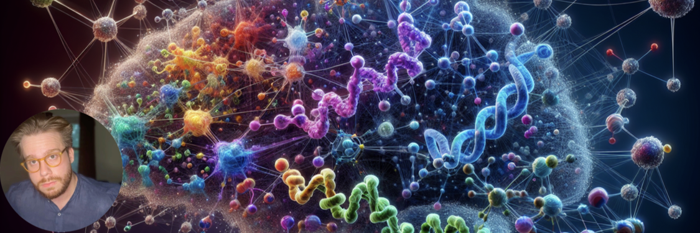

# 

# Leonardo Cotta

🐦 [Follow me on Twitter!](http://twitter.com/cottascience)

📩 [E-mail me!](mailto:leonardo.cotta@vectorinstitute.ai?subject=This)

💼 [Download my CV!](./cv.pdf)

# 💬 About

I'm a postdoc fellow at [Vector Institute](https://vectorinstitute.ai/), where I'm hosted by [Chris J. Maddison](https://www.cs.toronto.edu/~cmaddis/). I received my PhD degree in computer science at Purdue University, where I was advised by [Bruno Ribeiro](https://www.cs.purdue.edu/homes/ribeirob/). Before that ---in a distant and happy land--- I was a BSc student (also in CS) at UFMG, Brazil. During my time as an undergrad I worked with distributed algorithms (at UFMG) and quantum computing theory (at University of Calgary).

[Test](Untitled%20b94b7f1b34a44c6f85dfee9e7c895d85/Test%2005e0bc1ca33345a18192c735e3c813bf.md)

# 📝 Research

I'm broadly interested in statistical and causal machine learning. More specifically, I study the interplay between symmetries, computation, and learning. How can we leverage these concepts to build better (and practical) machine learning methodology? I believe these insights are specially relevant in problems with complex systems' data. Inspired by this, more recently I have been considering problems with applications in biochemistry.

# 🗞️ News

- New pre-print available! **"Probabilistic Invariant Learning with Randomized Linear Classifiers"** is now on [arXiv](https://arxiv.org/abs/2308.04412).
- Our work on **"Causal Lifting and Link Prediction"** is now published (w/ open access) in the Proceedings of the Royal Society A. Click [here](https://royalsocietypublishing.org/doi/10.1098/rspa.2023.0121) to check it out.
- I started as a Postdoc Fellow at the Vector Institute! If you're ever in Toronto and want to talk research, drop me a line!