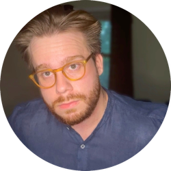

<div class="intro">
<div class="intro-text" markdown="1">

I'm a computer scientist (now @[EIT](https://eit.org/)) making and studying AI systems with real-world impact. Mostly focused on medicine and the life sciences.

Simple systems paired with large flop counts give life to complex, useful things.

Current (general) interests:

- generative models for discrete data;
- causal inference;
- uncertainty & data curation;
- scaling laws on scientific and medical data.

</div>

</div>

### Collabs

Big on open science, open source, and free education.

If you want to build something together (research or outreach), shoot me an email. For longer term collaborations, consider applying to one of our PhD programs: [Ellison Scholarships](https://eit.org/scholars), or the [AI Fundamentals CDT](https://www.eitcdt.ox.ac.uk/). Particularly hyped about working with folks from diverse backgrounds & communities.

### Chatting with me

I dedicate two hours every Saturday afternoon to mentoring students from underrepresented groups in computer science. If you're seeking guidance on research opportunities, graduate school applications, launching coding projects, or navigating your career path, I'd be happy to connect. Please, use the link below to schedule a time.

[Book a chat](https://calendar.app.google/USZEg3QtxHw3N8T69)

### Email

To contact me, execute:

```bash
printf '%3$s@%2$s.%1$s\n' org eit lcotta
```

I'm bad at email, but I do read everything. Unless you're recruiting me for finance, I'll eventually get back to you, trust me ;)

### Links

[google scholar](https://scholar.google.co.uk/citations?user=0GI4MyoAAAAJ&hl=en) / [twitter](https://x.com/cottascience) / [linkedin](https://linkedin.com/in/cotta) / [bluesky](https://bsky.app/profile/cottascience.bsky.social) / [github](https://github.com/cottascience)
